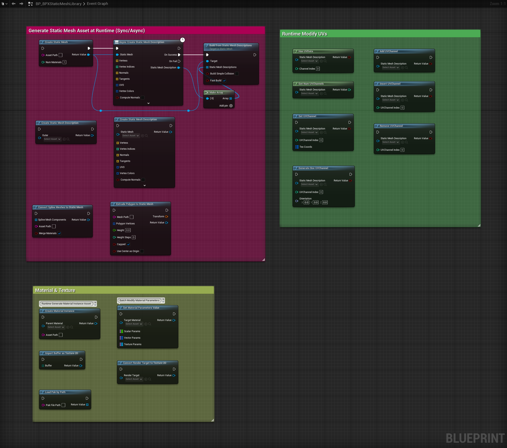

# BlueprintPro Plugin

BlueprintPro is a high-efficiency Blueprint enhancement plugin designed for Unreal Engine 5, aiming to greatly extend the Blueprint system's capabilities and improve development efficiency. The plugin integrates generic Blueprint nodes, powerful async task support, flexible static mesh and asset tools, and many advanced features, providing developers with a rich and easy-to-use toolkit. Whether for complex game logic, dynamic asset management, or real-time rendering and content generation, BlueprintPro empowers efficient project development and innovative implementation.

---

## 1. Main Features

- **Advanced Blueprint Nodes (Generic Support):** Numerous nodes are implemented generically, supporting slicing, sorting, filtering, max/min search, and dynamic property read/write for arrays of any type, greatly enhancing Blueprint development capabilities, reusability, and flexibility.
- **Async Support:** Built-in coroutine pool supports async static mesh asset creation, timers, and Blueprint async nodes, improving performance and responsiveness for complex tasks.
- **Static Mesh Tools:** Runtime/editor creation of static mesh assets, mesh description generation, spline mesh conversion, UV channel operations, polygon extrusion, and more.
- **Config Management:** Simplifies INI config file read/write, section/key management, array and property name operations, and supports dynamic configuration.
- **Material & Texture Tools:** Runtime/editor dynamic creation of material assets & instances, batch parameter setting, texture import/conversion, render target to texture, etc.
- **Modular Design:** Divided into runtime (BlueprintPro) and editor (BlueprintProEditor) modules, supporting both runtime Blueprint and editor extension nodes (e.g., array sort, object property nodes).
- **Resource Management:** Supports dynamic loading of external resources (images, textures, pak files), suitable for user-generated content and extensions.
- **Real-time Rendering Capture:** Supports converting render targets to textures for dynamic effects, screenshots, and content generation.
- **Cross-platform Support:** Compatible with major platforms such as Windows and macOS.  
  > Note: The plugin aims to support all major platforms including Windows, macOS, Linux, Android, iOS, etc. However, not all platforms have been fully tested. Please verify compatibility for your target platform in actual projects.

---

## 2. Advantages

- **Efficiency:** Coroutine pool and async task management significantly improve resource utilization and runtime efficiency.
- **Flexibility:** Supports dynamic generation of meshes, materials, textures, and more, suitable for various development scenarios.
- **Ease of Use:** Intuitive Blueprint nodes and libraries simplify the implementation of complex features.
- **Extensibility:** Modular design allows developers to extend features as needed for different project scales.
- **Performance Optimization:** Reduces overhead of dynamic resource allocation and optimizes runtime performance.
- **Dual Support:** All core features are callable from both C++ and Blueprints, meeting the needs of different developers.

---

## 3. Installation

### Method 1: Manual Installation

1. Place the `BlueprintPro` folder into your project's `Plugins` directory.
2. Enable BlueprintPro in the Unreal Editor's Plugin Manager.
3. Restart the editor.

### Method 2: Marketplace Installation

1. Open Epic Games Launcher and go to the Unreal Engine Marketplace.
2. Search for "BlueprintPro" and open the plugin page: [BlueprintPro](https://www.fab.com/listings/353e774e-d0e5-4c1b-b2cc-191b0c910aad).
3. Click "Add to Project" or "Install to Engine" and select your target project or engine version.
4. Launch Unreal Editor and confirm BlueprintPro is enabled in the Plugin Manager.
5. Restart the editor if prompted.

---

## 4. Module Overview

### 4.1 BlueprintPro
- **Type:** Runtime module  
- **Function:** Provides all generic Blueprint nodes, async tasks, static mesh, material, texture, config, and other runtime features for game logic, resource management, and dynamic content generation.

### 4.2 BlueprintProEditor
- **Type:** Editor module  
- **Function:** Extends the Blueprint editor with advanced nodes such as array sorting, object property nodes, data table row operations, etc., improving Blueprint development efficiency and visualization. Only enabled in the editor environment.

---

## 5. Types & Blueprint Functions

### 5.1 BPXArrayLibrary
**Purpose:**  
BPXArrayLibrary is the core Blueprint function library for array operations in BlueprintPro, supporting advanced operations on generic arrays. Through template and reflection mechanisms, it greatly enhances Blueprint's array handling capabilities for basic types, structs, objects, etc., simplifying complex array logic.

**Key Features:**
- **Generic Array Support:** Most functions use CustomThunk and templates to support arrays of any type (basic, struct, object, etc.).
- **Index Validation & Slicing:** Functions like `IsValidIndex`, `Slice` efficiently check index validity and extract subarrays.
- **Array Filtering:** Functions like `Filter Array By Function`, `FilterObjects` support filtering any array elements via custom Blueprint/C++ functions or delegates.
- **Max/Min Search:** Functions like `Max Array Elem`, `Min Array Elem` support finding max/min elements and their indices via custom comparison functions.
- **Sorting:** Functions like `Array Sort By Function` (custom comparison), `Array Sort By Property` (by property name), `Array Sort(Algo)` (basic/struct), `Array Sort(Object)` (object delegate sort).
- **High Performance & Safety:** Uses reflection, memory management, and type adaptation to ensure flexible and efficient operations, avoiding memory leaks.
- **Typical Usage:** For slicing, filtering, sorting, max/min search, and custom logic on any array type in Blueprints.

**C++ & Blueprint Function List:**


- **Array_IsValidIndex(const TArray<int32>& TargetArray, int32 Index)**  
  **Node Name:** IsValidIndex  
  **Parameters:**  
  - `TargetArray`: Target array  
  - `Index`: Index to validate  
  **Return:** `bool`  
  Checks if the provided index is valid for the target array.

- **Array_Slice(const TArray<int32>& TargetArray, int32 Index, int32 Length, TArray<int32>& OutArray)**
  **Node Name:** Slice    
  **Parameters:**  
  - `TargetArray`: Target array  
  - `Index`: Start index  
  - `Length`: Slice length  
  - `OutArray`: Output subarray  
  **Return:** None  
  Extracts a subarray from the target array.

- **Array_Filter(const UObject* Object, const FName FilterFunctionName, const TArray<int32>& TargetArray, TArray<int32>& FilteredArray)**
  **Node Name:** Filter Array By Function  
  **Parameters:**  
  - `Object`: Object owning the filter function  
  - `FilterFunctionName`: Filter function name  
  - `TargetArray`: Target array  
  - `FilteredArray`: Filtered array  
  **Return:** None  
  Filters array elements using the specified function.

- **Array_Max(const TArray<int32>& TargetArray, UObject* FunctionOwner, const FName CompareFunctionName, int32& Index, int32& MaxValue)**
  **Node Name:** Max Array Elem  
  **Parameters:**  
  - `TargetArray`: Target array  
  - `FunctionOwner`: Object owning the comparison function  
  - `CompareFunctionName`: Comparison function name  
  - `Index`: Index of max value  
  - `MaxValue`: Max value  
  **Return:** None  
  Finds the max value in the array using a custom comparison function.

- **Array_Min(const TArray<int32>& TargetArray, UObject* FunctionOwner, const FName CompareFunctionName, int32& Index, int32& MinValue)**
  **Node Name:** Min Array Elem    
  **Parameters:**  
  - `TargetArray`: Target array  
  - `FunctionOwner`: Object owning the comparison function  
  - `CompareFunctionName`: Comparison function name  
  - `Index`: Index of min value  
  - `MinValue`: Min value  
  **Return:** None  
  Finds the min value in the array using a custom comparison function.

- **Array_QuickSort(const TArray<int32>& TargetArray, UObject* FunctionOwner, FName CompareFunctionName)**
  **Node Name:** Array Sort By Function  
  **Parameters:**  
  - `TargetArray`: Target array  
  - `FunctionOwner`: Object owning the comparison function  
  - `CompareFunctionName`: Comparison function name  
  **Return:** None  
  Sorts the array using quicksort and a custom comparison function.

- **Array_SortV2(const TArray<int32>& TargetArray, FName ComparePropertyName, bool bAscending)** 
  **Node Name:** Array Sort By Property 
  **Parameters:**  
  - `TargetArray`: Target array  
  - `ComparePropertyName`: Property name for sorting  
  - `bAscending`: Ascending order  
  **Return:** None  
  Sorts the array by the specified property.

- **Array_SortAlgo(const TArray<int32>& TargetArray, bool bAscending)**
  **Node Name:** Array Sort(Algo)  
  **Parameters:**  
  - `TargetArray`: Target array  
  - `bAscending`: Ascending order  
  **Return:** None  
  Sorts the array using `Algo::Sort`.

- **Array_SortObjects(TArray<UObject*>& TargetArray, FObjectCompareDelegate CompareFunction, const bool bAscending)**
  **Node Name:** Array Sort(Object)   
  **Parameters:**  
  - `TargetArray`: Target object array  
  - `CompareFunction`: Comparison delegate  
  - `bAscending`: Ascending order  
  **Return:** None  
  Sorts an array of `UObject` pointers using a custom comparison function.

---

### 5.2 BPXConfigLibrary
**Purpose:**  
BPXConfigLibrary is a utility class based on UBlueprintFunctionLibrary, designed to simplify reading and managing Unreal Engine INI config files. It provides flexible interfaces for Blueprints and C++, supporting dynamic setting, getting, and deleting of config items, as well as batch operations on sections and keys, greatly improving automation and extensibility.

**Key Features:**
- **Generic Config Read/Write:** Supports reading/writing config items of any basic type and common structs (FVector, FColor, FDateTime, etc.), with automatic type conversion, compatible with Blueprints and C++.
- **Array & Property Operations:** Supports batch storage of string arrays and dynamic property name retrieval for complex config management.
- **Section & Key Management:** Get all config file names and section names, check section existence, batch clear sections, or clear by string match.
- **Flexible Deletion & Cleanup:** Supports deleting keys, clearing sections, and batch clearing matching sections for automated config cleanup and reset.
- **Default Section Name for Objects:** Automatically derives default config section names from UObject, facilitating object-oriented config management.
- **Blueprint Friendly:** All interfaces are callable from Blueprints, suitable for runtime and editor dynamic config needs.

**Blueprint Function List:**


- **SetConfigPropertyByName(const FString& Section, const FString& Key, const FString& FileName, const FString& Value)** 
  **Node Name:** Set Value  
  **Parameters:**  
  - `Section`: Section name  
  - `Key`: Key name  
  - `FileName`: Config file name  
  - `Value`: Value to set  
  **Return:** None  
  Sets the value for the specified section and key in the INI file.

- **GetConfigPropertyByName(const FString& Section, const FString& Key, const FString& FileName, FString& Value)**  
  **Node Name:** Get Value  
  **Parameters:**  
  - `Section`: Section name  
  - `Key`: Key name  
  - `FileName`: Config file name  
  - `Value`: Output value  
  **Return:** None  
  Gets the value for the specified section and key.

- **SetStringArray(const FString& Section, const FString& Key, const FString& FileName, const TArray<FString>& Value)**  
  **Parameters:**  
  - `Section`: Section name  
  - `Key`: Key name  
  - `FileName`: Config file name  
  - `Value`: String array  
  **Return:** None  
  Sets a string array for the specified section and key.

- **GetStringArray(const FString& Section, const FString& Key, const FString& FileName, TArray<FString>& Value)**  
  **Parameters:**  
  - `Section`: Section name  
  - `Key`: Key name  
  - `FileName`: Config file name  
  - `Value`: Output string array  
  **Return:** `int32`  
  Gets a string array for the specified section and key.

- **GetPropertyName(const int32& Property)**  
  **Parameters:**  
  - `Property`: Property identifier  
  **Return:** `FString`  
  Gets the property name by identifier.

- **GetConfigFileNames(TArray<FString>& ConfigFileNames)**  
  **Parameters:**  
  - `ConfigFileNames`: Output config file names  
  **Return:** None  
  Gets all config file names in the project.

- **GetSectionNames(const FString& FileName, TArray<FString>& SectionNames)**  
  **Parameters:**  
  - `FileName`: Config file name  
  - `SectionNames`: Output section names  
  **Return:** `bool`  
  Gets all section names in the specified config file.

- **DoesSectionExist(const FString& FileName, const FString& Section)**  
  **Parameters:**  
  - `FileName`: Config file name  
  - `Section`: Section name  
  **Return:** `bool`  
  Checks if the specified section exists in the config file.

- **RemoveKey(const FString& FileName, const FString& Section, const FString& Key)**  
  **Parameters:**  
  - `FileName`: Config file name  
  - `Section`: Section name  
  - `Key`: Key name  
  **Return:** None  
  Removes a key from the specified section.

- **RemoveSection(const FString& FileName, const FString& Section)**  
  **Parameters:**  
  - `FileName`: Config file name  
  - `Section`: Section name  
  **Return:** None  
  Clears all keys in the specified section.

- **EmptySectionsMatchingString(const FString& FileName, const FString& MatchString)**  
  **Parameters:**  
  - `FileName`: Config file name  
  - `MatchString`: Match string  
  **Return:** None  
  Clears all keys in sections whose names contain the specified string.

- **GetDefaultSectionName(UObject* Object)**  
  **Parameters:**  
  - `Object`: Target object  
  **Return:** `FString`  
  Gets the default section name associated with the specified `UObject` instance.

---

### 5.3 BPXMathLibrary
**Purpose:**  
BPXMathLibrary is a utility class based on UBlueprintFunctionLibrary, providing a rich set of math and geometry functions, covering date/time, string/ASCII conversion, spatial geometry, view transform/focus, and more. It simplifies complex math logic and improves Blueprint and C++ development efficiency, suitable for spatial analysis, scene layout, auto-focus, text processing, and more.

**Key Features:**
- **Date/Time Handling:** Functions like `GetDayOfWeek`, `GetMonthOfYear` get day and month names for date logic.
- **String & ASCII Conversion:** Functions like `Conv_AsciiToString`, `Conv_StringToAscii` convert between ASCII codes and characters.
- **Geometry Calculation:** Functions like `GetCenterAndSize` quickly get the center and size of a bounding box.
- **View Transform & Focus:** Functions like `GetViewportTransformFromActors`, `GetViewportTransformFromBoundingBox` auto-calculate view transform matrices for actors/components/bounding boxes, enabling one-click focus and auto-zoom.
- **Union Bounding Box Calculation:** Functions like `GetBoundingBoxFromActorsAndComponents` compute the union bounding box for multiple actors and components.

**Blueprint Function List:**


- **GetDayOfWeek(FDateTime A)**  
  **Parameters:**  
  - `A`: DateTime object  
  **Return:** `FString`  
  Gets the day of the week for the specified date.

- **GetMonthOfYear(FDateTime A)**  
  **Parameters:**  
  - `A`: DateTime object  
  **Return:** `FString`  
  Gets the month name for the specified date.

- **Conv_AsciiToString(int32 AsciiCode)**
  **Node Name:** To String (Ascii) 
  **Parameters:**  
  - `AsciiCode`: ASCII code  
  **Return:** `FString`  
  Converts an ASCII code to its character string.

- **Conv_StringToAscii(FString AsciiChar)** 
  **Node Name:** To Integer (Ascii) 
  **Parameters:**  
  - `AsciiChar`: Character in string  
  **Return:** `int32`  
  Converts a character in a string to its ASCII code.

- **GetCenterAndSize(const FBox& Box, FVector& Center, FVector& Size)**  
  **Parameters:**  
  - `Box`: Target bounding box  
  - `Center`: Output center  
  - `Size`: Output size  
  **Return:** None  
  Calculates the center and size of the specified bounding box.

- **GetViewportTransformFromActors(const TArray<AActor*>& Actors, const float Factor = 1.0f)**  
  **Node Name:** Focus Actors  
  **Parameters:**  
  - `Actors`: Target actor array  
  - `Factor`: Scale factor  
  **Return:** `FTransform`  
  Calculates the view transform matrix from the bounding box of a set of actors.

- **GetViewportTransformFromActorsAndComponents(const TArray<AActor*>& Actors, const TArray<UPrimitiveComponent*>& Components, const float Factor = 1.0f)**  
  **Node Name:** Focus Actors and Components  
  **Parameters:**  
  - `Actors`: Target actor array  
  - `Components`: Target component array  
  - `Factor`: Scale factor  
  **Return:** `FTransform`  
  Calculates the view transform matrix from the bounding box of actors and components.

- **GetBoundingBoxFromActorsAndComponents(const TArray<AActor*>& Actors, const TArray<UPrimitiveComponent*>& Components)**  
  **Node Name:** Get Bounding Box  
  **Parameters:**  
  - `Actors`: Target actor array  
  - `Components`: Target component array  
  **Return:** `FBox`  
  Calculates the union bounding box of a set of actors and components.

- **GetViewportTransformFromBoundingBox(const FBox& BoundingBox, const float Factor = 1.0f)**  
  **Node Name:** Focus BoundingBox  
  **Parameters:**  
  - `BoundingBox`: Target bounding box  
  - `Factor`: Scale factor  
  **Return:** `FTransform`  
  Calculates the view transform matrix from a bounding box.

---

### 5.4 BPXObjectLibrary
**Purpose:**  
BPXObjectLibrary is a utility class based on UBlueprintFunctionLibrary, designed for dynamic manipulation of UObject and its derived class properties and AActor components. It supports flexible runtime setting and getting of various object properties (including single property, array, map, set, etc.), and provides batch management of actor components. Through reflection and generic mechanisms, it greatly simplifies complex object and component operations, improving Blueprint and C++ development efficiency, suitable for data-driven, dynamic construction, and advanced editor extension scenarios.

**Key Features:**
- **Dynamic Property Read/Write:** Supports setting and getting single, array, map, and set properties of UObject dynamically by property name, suitable for reflection and data-driven scenarios.
- **Type Safety & Generic Support:** Uses reflection and generic templates to ensure type safety and support various common data structures. No need for Cast nodes in Blueprints, avoiding strong coupling and type dependencies.
- **Batch Component Management:** Supports dynamically adding, removing, and clearing component instances for actors at runtime, facilitating dynamic construction and restructuring of actor hierarchies.
- **Blueprint Friendly:** All interfaces are callable from Blueprints, suitable for runtime and editor dynamic object management needs.

**Blueprint Function List:**


- **SetSinglePropertyByName(UObject* Object, FName PropertyName, const int32& Value)**  
  **Node Name:** Set Property By Name  
  **Parameters:**  
  - `Object`: Target object  
  - `PropertyName`: Property name  
  - `Value`: Value to set  
  **Return:** None  
  Dynamically sets a single property value of the specified `UObject`.

- **GetSinglePropertyByName(UObject* Object, FName PropertyName, int32& Value)**  
  **Node Name:** Get Property By Name  
  **Parameters:**  
  - `Object`: Target object  
  - `PropertyName`: Property name  
  - `Value`: Output value  
  **Return:** `bool`  
  Dynamically gets a single property value of the specified `UObject`.

- **GetArrayPropertyByName(UObject* Object, FName PropertyName, TArray<int32>& Value)**  
  **Parameters:**  
  - `Object`: Target object  
  - `PropertyName`: Property name  
  - `Value`: Output array value  
  **Return:** `bool`  
  Dynamically gets an array property value of the specified `UObject`.

- **GetMapPropertyByName(UObject* Object, FName PropertyName, TMap<int32, int32>& Value)**  
  **Parameters:**  
  - `Object`: Target object  
  - `PropertyName`: Property name  
  - `Value`: Output map value  
  **Return:** `bool`  
  Dynamically gets a map property value of the specified `UObject`.

- **GetSetPropertyByName(UObject* Object, FName PropertyName, TSet<int32>& Value)**  
  **Parameters:**  
  - `Object`: Target object  
  - `PropertyName`: Property name  
  - `Value`: Output set value  
  **Return:** `bool`  
  Dynamically gets a set property value of the specified `UObject`.

- **AddInstanceComponent(AActor* TargetActor, UActorComponent* Component)**  
  **Parameters:**  
  - `TargetActor`: Target actor  
  - `Component`: Component instance to add  
  **Return:** None  
  Adds a component instance to the specified actor.

- **RemoveInstanceComponent(AActor* TargetActor, UActorComponent* Component)**  
  **Parameters:**  
  - `TargetActor`: Target actor  
  - `Component`: Component instance to remove  
  **Return:** None  
  Removes a component instance from the specified actor.

- **ClearInstanceComponents(AActor* TargetActor, bool bDestroyComponents)**  
  **Parameters:**  
  - `TargetActor`: Target actor  
  - `bDestroyComponents`: Whether to destroy components  
  **Return:** None  
  Clears all component instances of the specified actor.

---

### 5.5 BPXStaticMeshLibrary
**Purpose:**  
BPXStaticMeshLibrary is a utility class based on UBlueprintFunctionLibrary, designed for static mesh, material, and texture creation and editing. It integrates static mesh generation and conversion, batch material parameter setting, texture import and conversion, UV channel operations, and more, greatly simplifying complex asset workflows. Whether at runtime or in the editor, developers can efficiently generate dynamic content, manage assets in batches, and perform advanced rendering operations via Blueprint or C++.

**Key Features:**
- **Static Mesh Operations:** Supports static mesh creation, mesh description generation, spline mesh conversion, and 2D polygon extrusion to 3D mesh at runtime or in the editor.
- **Material & Texture Management:** Supports creation and batch parameter setting of material instances and assets, texture creation/import, render target to texture, and more.
- **UV Channel Operations:** Supports adding, inserting, removing, checking, and auto-generating UV channels (planar, cylindrical, box mapping), suitable for advanced mapping and rendering needs.
- **Batch Resource Loading:** Supports batch loading resources via .pak files for dynamic content expansion and hot updates.
- **Blueprint Friendly:** All interfaces are callable from C++ and Blueprints, suitable for dynamic resource and mesh management at runtime and in the editor.

**Blueprint Function List:**


**Material Operations**

- **CreateMaterialInstance(UMaterialInterface* ParentMaterial, const FString& AssetPath)**  
  **Parameters:**  
  - `ParentMaterial`: Parent material for creating the instance  
  - `AssetPath`: Save path for the material instance  
  **Return:** `UMaterialInstance*`  
  Creates or loads a material instance. If an instance exists at the specified path, it loads it; otherwise, it creates a new one based on the parent material and saves it to the path.  
  Supports dynamic material instance asset generation at runtime or in the editor for batch asset management and custom material workflows.

- **SetMaterialParametersValue(UMaterialInstance* TargetMaterial, const TMap<FName, float>& ScalarParams, const TMap<FName, FLinearColor>& VectorParams, const TMap<FName, UTexture*>& TextureParams)**  
  **Parameters:**  
  - `TargetMaterial`: Target material instance  
  - `ScalarParams`: Scalar parameter name-value map  
  - `VectorParams`: Vector parameter name-value map  
  - `TextureParams`: Texture parameter name-value map  
  **Return:** `UMaterialInstance*`  
  Batch sets scalar, vector, and texture parameters for a material instance.

**Texture Operations**

- **CreateTexture2D(const FString& AssetPath, int32 InSizeX, int32 InSizeY, EPixelFormat InFormat)**  
  **Parameters:**  
  - `AssetPath`: Save path for the texture  
  - `InSizeX`: Texture width  
  - `InSizeY`: Texture height  
  - `InFormat`: Texture pixel format  
  **Return:** `UTexture2D*`  
  Creates a new texture object.

- **ImportImageAsTexture2D(const FString& FilePath, const FString& AssetPath)**  
  **Parameters:**  
  - `FilePath`: Image file path  
  - `AssetPath`: Save path for the texture  
  **Return:** `UTexture2D*`  
  (Editor only) Imports an image from file and creates a texture object, supporting automatic MipMap generation.  
  Supports common formats (PNG, JPG, BMP, TGA, EXR, etc.), suitable for batch asset import and high-quality texture processing.

- **ImportBufferAsTexture2D(const TArray<uint8>& Buffer)**  
  **Parameters:**  
  - `Buffer`: Byte buffer of image data  
  **Return:** `UTexture2D*`  
  Imports an image from a byte buffer and creates a texture object.

- **ConvertRenderTargetToTexture2D(UTextureRenderTarget2D* RenderTarget)**  
  **Parameters:**  
  - `RenderTarget`: Render target object  
  **Return:** `UTexture2D*`  
  Converts a render target to a texture object.

**Static Mesh Operations**

- **CreateStaticMesh(const FString& AssetPath, int32 NumMaterials)**  
  **Parameters:**  
  - `AssetPath`: Save path for the static mesh  
  - `NumMaterials`: Number of materials  
  **Return:** `UStaticMesh*`  
  Creates or loads a static mesh object.

- **CreateStaticMeshDescription(UStaticMesh* StaticMesh, const TArray<FVector3f>& Vertexs, const TArray<int32>& VertexIndices, const TArray<FVector3f>& Normals, const TArray<FVector3f>& Tangents, const TArray<FVector2f>& UV0, const TArray<FVector2f>& UV1, const TArray<FLinearColor>& VertexColors, bool bComputeNormals)**  
  **Parameters:**  
  - `StaticMesh`: Target static mesh object  
  - `Vertexs`: Vertex list  
  - `VertexIndices`: Vertex index list  
  - `Normals`: Normal list  
  - `Tangents`: Tangent list  
  - `UV0`: UV channel 0  
  - `UV1`: UV channel 1  
  - `VertexColors`: Vertex color list  
  - `bComputeNormals`: Whether to compute normals  
  **Return:** `UStaticMeshDescription*`  
  Creates a static mesh description from mesh data.

- **ConvertSplineMeshesToStaticMesh(const TArray<USplineMeshComponent*>& SplineMeshComponents, const FString& AssetPath, bool bMergeMaterials)**  
  **Parameters:**  
  - `SplineMeshComponents`: Spline mesh component array  
  - `AssetPath`: Save path for the static mesh  
  - `bMergeMaterials`: Whether to merge materials  
  **Return:** `UStaticMesh*`  
  Converts an array of spline mesh components to a static mesh object.

- **ExtrudePolygonToStaticMesh(const FString& MeshPath, const TArray<FVector2D>& PolygonVertices, FTransform& Transform, float Height, int32 HeightSteps, bool bCapped, bool bUseCenterAsOrigin)**  
  **Parameters:**  
  - `MeshPath`: Save path for the static mesh  
  - `PolygonVertices`: Polygon vertex list  
  - `Transform`: Transform info  
  - `Height`: Extrusion height  
  - `HeightSteps`: Height steps  
  - `bCapped`: Whether to cap  
  - `bUseCenterAsOrigin`: Whether to use center as origin  
  **Return:** `UStaticMesh*`  
  Extrudes a 2D polygon to generate a 3D static mesh.

**UV Channel Operations**

- **SetUVChannel(UStaticMeshDescription* StaticMeshDescription, int32 UVChannelIndex, const TMap<FVertexInstanceID, FVector2D>& TexCoords)**  
  **Parameters:**  
  - `StaticMeshDescription`: Target static mesh description  
  - `UVChannelIndex`: UV channel index  
  - `TexCoords`: Texture coordinate map  
  **Return:** `bool`  
  Sets the texture coordinates for the specified UV channel.

- **GetNumUVChannels(UStaticMeshDescription* StaticMeshDescription)**  
  **Parameters:**  
  - `StaticMeshDescription`: Target static mesh description  
  **Return:** `int32`  
  Gets the number of UV channels.

- **HasUVData(UStaticMeshDescription* StaticMeshDescription, int32 ChannelIndex)**  
  **Parameters:**  
  - `StaticMeshDescription`: Target static mesh description  
  - `ChannelIndex`: UV channel index  
  **Return:** `bool`  
  Checks if the specified UV channel contains valid data.

- **AddUVChannel(UStaticMeshDescription* StaticMeshDescription)**  
  **Parameters:**  
  - `StaticMeshDescription`: Target static mesh description  
  **Return:** `bool`  
  Adds a new UV channel.

- **RemoveUVChannel(UStaticMeshDescription* StaticMeshDescription, int32 UVChannelIndex)**  
  **Parameters:**  
  - `StaticMeshDescription`: Target static mesh description  
  - `UVChannelIndex`: UV channel index  
  **Return:** `bool`  
  Removes the specified UV channel.

- **GenerateBoxUVChannel(UStaticMeshDescription* StaticMeshDescription, int32 UVChannelIndex, const FRotator Orientation)**  
  **Parameters:**  
  - `StaticMeshDescription`: Target static mesh description  
  - `UVChannelIndex`: UV channel index  
  - `Orientation`: Box UV mapping orientation  
  **Return:** `bool`  
  Generates box UV mapping for the mesh.

---

### 5.6 BPX Async Action Class
**Purpose:**  
The Async Action class series provides BlueprintPro with a rich set of asynchronous Blueprint nodes, covering coroutines, timers, async mesh processing, and more. These classes are based on UBlueprintAsyncActionBase and FTickableGameObject, supporting non-blocking execution of delays, loops, concurrency, and other complex tasks in Blueprints. With event delegates and automatic lifecycle management, they greatly enhance Blueprint's async programming capabilities and runtime efficiency, suitable for animation, resource loading, timed logic, and more.

**Key Features:**
- **Async Coroutine Support:** `Async_CreateCoroutine` and `Async_CreateCoroutineAdvance` enable advanced coroutine control in Blueprints, including delayed start, timed updates, progress callbacks, pause/resume, etc.
- **Async Static Mesh Processing:** `Async_CreateStaticMeshDesc` supports async generation and application of static mesh descriptions in Blueprints, suitable for large data or time-consuming operations.
- **Flexible Timer Nodes:** `Async_SetTimer`, `Async_SetTimerByObject`, and `Async_SetTimerForNextTick` provide looping, one-shot, object-level, and next-tick timers for event-driven and sequence control.
- **Blueprint Friendly:** All async nodes can be called directly in Blueprints, support event delegate callbacks, and integrate easily with existing Blueprint logic.
- **High Performance & Resource Management:** Node lifecycles are managed automatically, supporting garbage collection and resource reuse to avoid memory leaks and waste.

#### 5.6.1 Types

- **UAsync_CreateCoroutine**  
  For creating async coroutines, supporting delayed start, timed updates, and finish events.

- **UAsync_CreateCoroutineAdvance**  
  Provides advanced coroutine features, allowing finer control including update intervals and duration.

- **UAsync_CreateStaticMeshDesc**  
  Async creation of static mesh descriptions, supporting custom vertex, normal, UV, and material data.

- **UAsync_SetTimer**  
  Async timer setup, supporting looping and one-shot timers.

- **UAsync_SetTimerByObject**  
  Sets a timer for a specified object, supporting delayed start and looping.

- **UAsync_SetTimerForNextTick**  
  Sets a timer to trigger an event on the next tick.

#### 5.6.2 Blueprint Functions


- **CreateCoroutine**  
  Creates an async coroutine with delayed start and timed updates.  
  **Parameters:**  
  - `WorldContextObject`: Context object (usually World or Actor).  
  - `Object`: Object associated with the coroutine.  
  - `Delay`: Start delay (seconds).  
  - `Duration`: Coroutine duration (seconds).  
  **Return:** `UAsync_CreateCoroutine` instance.

- **CreateCoroutineAdvance**  
  Creates an advanced async coroutine with finer control.  
  **Parameters:**  
  - `WorldContextObject`: Context object.  
  - `Object`: Associated object.  
  - `Delay`: Start delay (seconds).  
  - `Duration`: Coroutine duration (seconds).  
  **Return:** `UAsync_CreateCoroutineAdvance` instance.

- **AsyncCreateStaticMeshDescription**  
  Asynchronously creates a static mesh description and applies it to a static mesh.  
  **Parameters:**  
  - `WorldContextObject`: Context object.  
  - `StaticMesh`: Target static mesh.  
  - `Vertexs`: Vertex array.  
  - `VertexIndices`: Vertex index array.  
  - `Normals`: Normal array.  
  - `Tangents`: Tangent array.  
  - `UV0`: UV data.  
  - `VertexColors`: Vertex color array.  
  **Return:** `UAsync_CreateStaticMeshDesc` instance.

- **SetTimer**  
  Sets an async timer.  
  **Parameters:**  
  - `WorldContextObject`: Context object.  
  - `Time`: Timer duration (seconds).  
  - `bLooping`: Whether to loop.  
  - `InitialStartDelay`: Initial delay (seconds).  
  **Return:** `UAsync_SetTimer` instance.

- **SetTimerByObject**  
  Sets a timer for a specified object.  
  **Parameters:**  
  - `WorldContextObject`: Context object.  
  - `Object`: Target object.  
  - `Time`: Timer duration (seconds).  
  - `bLooping`: Whether to loop.  
  - `InitialStartDelay`: Initial delay (seconds).  
  **Return:** `UAsync_SetTimerByObject` instance.

- **SetTimerForNextTick**  
  Sets a timer to trigger on the next tick.  
  **Parameters:**  
  - `WorldContextObject`: Context object.  
  - `Object`: Target object.  
  **Return:** `UAsync_SetTimerForNextTick` instance.

---

### 5.7 BlueprintProSubsystem
**Purpose:**  
BlueprintProSubsystem is based on UGameInstanceSubsystem and is designed for efficient coroutine pool management. It provides unified coroutine allocation, recycling, and release mechanisms for the project, greatly simplifying the lifecycle management of async tasks. Coroutine pool reuse significantly improves resource utilization and concurrency, suitable for complex async scheduling and high-performance scenarios.

**Key Features:**
- Automatically manages coroutine object creation and recycling, avoiding performance loss from frequent allocation/destruction.
- Provides convenient interfaces, mainly for C++ use (Blueprints usually do not call directly).
- Supports returning or releasing all coroutines at once for resource cleanup.
- Suitable for high-frequency async operations and complex task scheduling in games and tools.

**C++ Function List:**
- **RequestCoroutine()**  
  **Parameters:** None  
  **Return:** `UCoroutineHandle*`  
  Requests an available `UCoroutineHandle` from the pool; allocates a new one if none are available.

- **ReturnCoroutine(UCoroutineHandle* Coroutine)**  
  **Parameters:**  
  - `Coroutine`: The coroutine handle to return to the pool.  
  **Return:** None  
  Returns a coroutine handle obtained from `RequestCoroutine()` to the pool.

- **ReturnAllCoroutines()**  
  **Parameters:** None  
  **Return:** None  
  Returns all created coroutines to the pool.

- **FreeAllCoroutines()**  
  **Parameters:** None  
  **Return:** None  
  Returns all created coroutines to the pool and allows them to be garbage collected.

---

### 5.8 UCoroutineHandle
**Purpose:**  
UCoroutineHandle is the core handle type of the BlueprintPro coroutine system, responsible for managing the lifecycle, state, and progress of a single coroutine. Developers can use this type in Blueprints or C++ to pause, resume, or terminate coroutines, and to get/set progress and associated objects. Its usage is similar to Unreal Engine's TimerHandle, but UCoroutineHandle supports richer async control such as progress management, object references, pause/resume, etc., suitable for more complex async and coroutine scenarios.

**Key Features:**
- Callable from both Blueprints and C++ for flexible coroutine control in various scenarios.
- Provides pause, resume, and invalidate (terminate) operations.
- Supports getting/setting coroutine progress for progress bars, animations, etc.
- Can get the associated object reference for event-driven and object management.

**Common Function List:**
- **PauseCoroutine()**  
  **Parameters:** None  
  **Return:** None  
  Pauses coroutine execution.

- **UnPauseCoroutine()**  
  **Parameters:** None  
  **Return:** None  
  Resumes a paused coroutine.

- **Invalidate()**  
  **Parameters:** None  
  **Return:** None  
  Terminates the coroutine and releases resources.

- **SetProgress(float Value)**  
  **Parameters:**  
  - `Value`: Progress value (0~1).  
  **Return:** None  
  Sets coroutine progress.

- **IsCoroutinePaused()**  
  **Parameters:** None  
  **Return:** `bool`  
  Checks if the coroutine is paused.

- **IsCoroutineExists()**  
  **Parameters:** None  
  **Return:** `bool`  
  Checks if the coroutine is valid.

- **Reset()**  
  **Parameters:** None  
  **Return:** None  
  Resets coroutine state and associated object.

---

## 6. Usage Examples

### 6.1 Material Example

#### 6.1.1 Create Material Instance

Use the `CreateMaterialInstance` function to create or load a material instance.

```cpp
#include "BPXMaterialLibrary.h"

UMaterialInterface* ParentMaterial = ...; // Get parent material
FString AssetPath = TEXT("/Game/MyFolder/MyMaterialInstance"); // Specify material instance path
UMaterialInstance* MaterialInstance = UBPXMaterialLibrary::CreateMaterialInstance(ParentMaterial, AssetPath);

if (MaterialInstance)
{
    UE_LOG(LogTemp, Log, TEXT("Successfully created or loaded material instance"));
}
else
{
    UE_LOG(LogTemp, Error, TEXT("Failed to create or load material instance"));
}
```

#### 6.1.2 Set Material Parameter Values

Use the `SetMaterialParametersValue` function to set parameter values for a material instance.

```cpp
#include "BPXMaterialLibrary.h"

UMaterialInstance* TargetMaterial = ...; // Get target material instance
TMap<FName, float> ScalarParams;
ScalarParams.Add(TEXT("MyScalarParam"), 1.0f); // Add scalar parameter

TMap<FName, FLinearColor> VectorParams;
VectorParams.Add(TEXT("MyVectorParam"), FLinearColor(1.0f, 0.0f, 0.0f, 1.0f)); // Add vector parameter

TMap<FName, UTexture*> TextureParams;
UTexture* MyTexture = ...; // Get texture
TextureParams.Add(TEXT("MyTextureParam"), MyTexture); // Add texture parameter

UMaterialInstance* UpdatedMaterialInstance = UBPXMaterialLibrary::SetMaterialParametersValue(TargetMaterial, ScalarParams, VectorParams, TextureParams);

if (UpdatedMaterialInstance)
{
    UE_LOG(LogTemp, Log, TEXT("Successfully set material parameter values"));
}
else
{
    UE_LOG(LogTemp, Error, TEXT("Failed to set material parameter values"));
}
```

### 6.2 Runtime Static Mesh Creation Example

#### 6.2.1 Create Static Mesh

Use the `CreateStaticMesh` function to create or load a static mesh.

```cpp
#include "BPXStaticMeshLibrary.h"

FString AssetPath = TEXT("/Game/MyFolder/MyStaticMesh"); // Specify static mesh path
int32 NumMaterials = 2; // Specify number of materials
UStaticMesh* StaticMesh = UBPXStaticMeshLibrary::CreateStaticMesh(AssetPath, NumMaterials);

if (StaticMesh)
{
    UE_LOG(LogTemp, Log, TEXT("Successfully created or loaded static mesh"));
}
else
{
    UE_LOG(LogTemp, Error, TEXT("Failed to create or load static mesh"));
}
```

#### 6.2.2 Create Mesh Description

Use the `CreateMeshDescription` function to create a mesh description.

```cpp
#include "BPXStaticMeshLibrary.h"

TArray<FVector3f> Vertexs = { FVector3f(0, 0, 0), FVector3f(100, 0, 0), FVector3f(0, 100, 0) }; // Vertex data
TArray<int32> VertexIndices = { 0, 1, 2 }; // Index data
TArray<FVector3f> Normals = { FVector3f(0, 0, 1), FVector3f(0, 0, 1), FVector3f(0, 0, 1) }; // Normal data
TArray<FVector3f> Tangents = { FVector3f(1, 0, 0), FVector3f(1, 0, 0), FVector3f(1, 0, 0) }; // Tangent data
TArray<FVector2f> UV0 = { FVector2f(0, 0), FVector2f(1, 0), FVector2f(0, 1) }; // UV data
TArray<FLinearColor> VertexColors = { FLinearColor::Red, FLinearColor::Green, FLinearColor::Blue }; // Vertex colors

FMeshDescription* MeshDescription = UBPXStaticMeshLibrary::CreateMeshDescription(Vertexs, VertexIndices, Normals, Tangents, UV0, {}, VertexColors, false);

if (MeshDescription)
{
    UE_LOG(LogTemp, Log, TEXT("Successfully created mesh description"));
}
else
{
    UE_LOG(LogTemp, Error, TEXT("Failed to create mesh description"));
}
```

#### 6.2.3 Apply to BuildFromStaticMeshDescriptions

Use the `BuildFromStaticMeshDescriptions` function to build static mesh LODs from multiple static mesh descriptions.

```cpp
#include "Engine/StaticMesh.h"

TArray<UStaticMeshDescription*> StaticMeshDescriptions;
// Assume multiple UStaticMeshDescription objects have been created and added to the array
StaticMeshDescriptions.Add(...); // Add static mesh description object
StaticMeshDescriptions.Add(...);

bool bBuildSimpleCollision = true; // Whether to build simple collision
bool bFastBuild = true; // Whether to build fast

UStaticMesh* StaticMesh = ...; // Get target static mesh
StaticMesh->BuildFromStaticMeshDescriptions(StaticMeshDescriptions, bBuildSimpleCollision, bFastBuild);

UE_LOG(LogTemp, Log, TEXT("Successfully built static mesh LOD from descriptions"));
```

---

## 7. Additional Resources

To help you learn and use the BlueprintPro plugin more efficiently, we have compiled a series of Bilibili video tutorials and demos, covering practical operations from basic installation to advanced features.  
**Note: BlueprintPro is very feature-rich and it's difficult to demonstrate all features in videos. The following videos only cover some features and do not represent all capabilities of BlueprintPro. For more advanced usage, please refer to the documentation or future video updates.**

**Bilibili Tutorial Video List:**

- [BlueprintPro Plugin Tutorial 0 - List All Blueprint Nodes](https://www.bilibili.com/video/BV1a64y1J7uM)
- [BlueprintPro Plugin Tutorial 1 - Generic Node Array Sort Example](https://www.bilibili.com/video/BV1tw411G7kj)
- [BlueprintPro Plugin Tutorial 2 - Async Timer Node Example](https://www.bilibili.com/video/BV1fi4y1h7At)
- [BlueprintPro Plugin Tutorial 3 - Config Node Usage Example](https://www.bilibili.com/video/BV1Dg4y1k7m7)

More tutorials: [Bilibili Playlist](https://space.bilibili.com/3222082/channel/seriesdetail?sid=2822422)

---

## 8. Support & Contact

If you have any questions about BlueprintPro or need support, feel free to contact us:

- **Author:** XUSJTUER  
- **Email:** xusjtuer@163.com  
- **GitHub:** [https://github.com/xusjtuer](https://github.com/xusjtuer)  
- **Documentation:** [README_en.md](https://github.com/xusjtuer/FabTutorials/blob/main/BlueprintPro/README_en.md) ; [README_zh.md](https://github.com/xusjtuer/FabTutorials/blob/main/BlueprintPro/README_zh.md)  
- **Support Page:** [Support Page](https://github.com/xusjtuer/FabTutorials/issues)

For bug reports or suggestions, please use GitHub Issues first. We will respond as soon as possible!

---