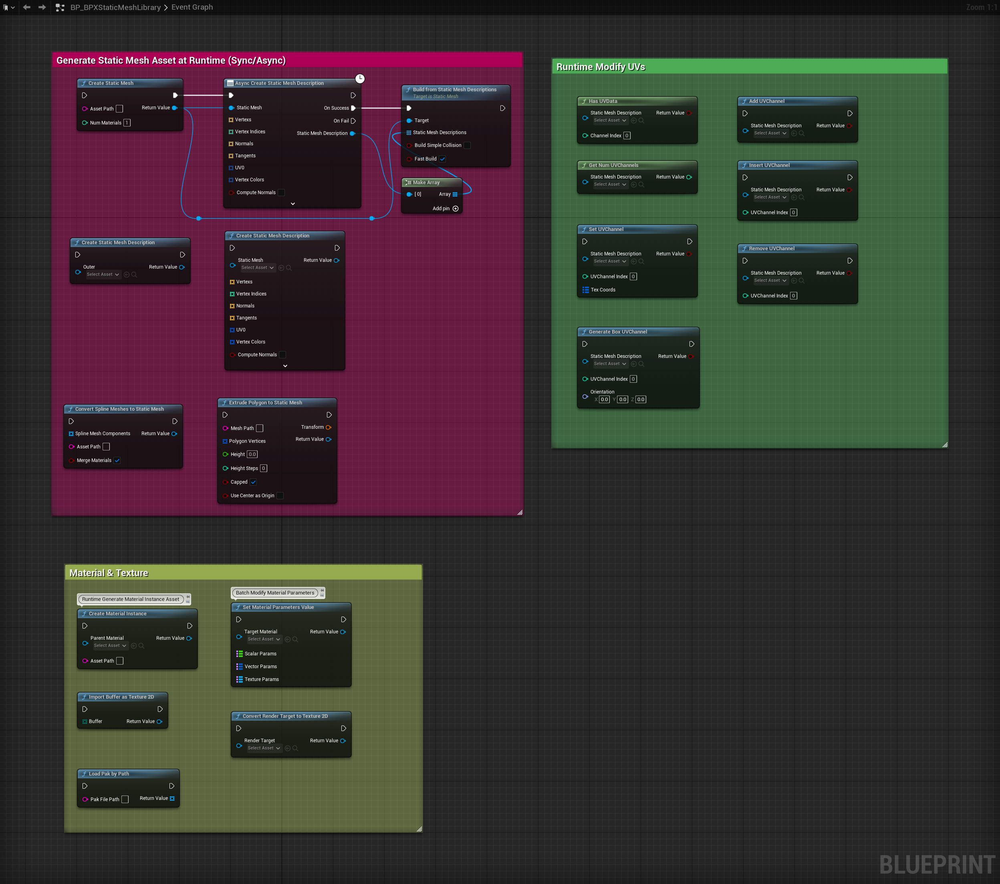
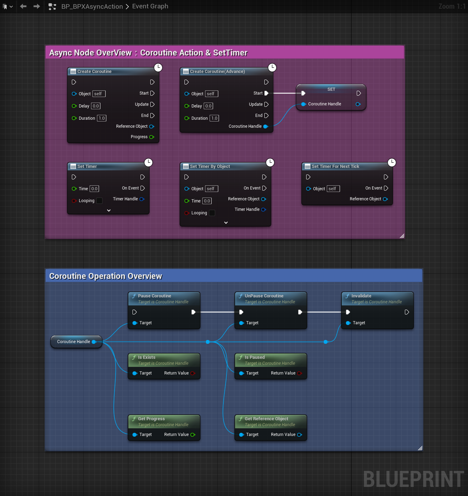

# BlueprintPro 插件

BlueprintPro 是一款专为 Unreal Engine 5 打造的高效蓝图增强插件，致力于大幅扩展蓝图系统的能力并提升开发效率。插件集成了泛型蓝图节点、强大的异步任务支持、灵活的静态网格与资源处理工具等多项高级功能，为开发者提供了丰富且易用的工具集。无论是复杂的游戏逻辑、动态资源管理，还是实时渲染与内容生成，BlueprintPro 都能助力项目高效开发与创新实现。

---

## 1. 主要特性

- **高级蓝图节点（泛型支持）**：大量节点采用泛型实现，支持任意类型数组的切片、排序、过滤、最大/最小查找、对象反射属性动态读写操作等，极大丰富蓝图开发能力，提升复用性和灵活性。
- **异步支持**：内置协程池，支持异步创建静态网格资产、定时器、蓝图异步节点，提升复杂任务性能与响应性。
- **静态网格工具**：支持静态网格资产的运行时/编辑器创建、网格描述生成、样条网格转换、UV通道操作、挤出多边形等高级功能。
- **配置管理**：简化 INI 配置文件的读写、节与键管理、数组与属性名操作，支持动态配置。
- **材质与纹理工具**：支持运行时/编辑器动态创建材质资产&实例、批量设置材质参数、纹理导入与转换、渲染目标转纹理等。
- **模块化设计**：分为运行时（BlueprintPro）与编辑器（BlueprintProEditor）两大模块，分别支持运行时蓝图与编辑器扩展节点（如数组排序、对象属性节点）。
- **资源管理**：支持动态加载外部资源（图片、纹理、pak 文件），适用于用户自定义内容和扩展。
- **实时渲染捕获**：支持将渲染目标转换为纹理，适合动态效果、截图、内容生成等场景。
- **跨平台支持**：兼容 Windows、macOS 等主流平台。  
  > 说明：插件旨在支持包括 Windows、macOS、Linux、Android、iOS 等在内的常见主流平台，但部分平台尚未逐一全面测试，建议在实际项目中根据目标平台进行兼容性验证。

---

## 2. 优点

- **高效性**：通过协程池和异步任务管理，显著提高资源利用率和运行效率。
- **灵活性**：支持动态生成网格、材质和纹理等资产，适用于多种开发场景。
- **易用性**：提供直观的蓝图节点和工具库，简化复杂功能的实现。
- **可扩展性**：模块化设计允许开发者根据需求扩展功能，适应不同项目规模。
- **性能优化**：减少动态资源分配的开销，优化游戏运行时的性能。
- **双重支持**：所有核心功能均支持 C++ 和蓝图调用，满足不同开发者的使用习惯和需求。

---

## 3. 安装说明

### 方式一：手动安装

1. 将 `BlueprintPro` 文件夹放入项目的 `Plugins` 目录。
2. 在 Unreal Editor 插件管理器中启用 BlueprintPro。
3. 重新启动编辑器。

### 方式二：商城安装

1. 打开 Epic Games Launcher，进入 Unreal Engine 市场（Marketplace）。
2. 搜索 “BlueprintPro” 并点击进入插件页面[BlueprintPro](https://www.fab.com/listings/353e774e-d0e5-4c1b-b2cc-191b0c910aad)。
3. 点击“添加到项目”或“安装到引擎”，选择目标项目或引擎版本。
4. 启动 Unreal Editor，在插件管理器中确认 BlueprintPro 已启用。
5. 如有提示，重启编辑器以完成插件加载。

---

## 4. 模块说明

### 4.1 BlueprintPro
- **类型**：运行时模块  
- **功能**：提供所有泛型蓝图节点、异步任务、静态网格、材质、纹理、配置等运行时功能，适用于游戏逻辑、资源管理和动态内容生成等场景。

### 4.2 BlueprintProEditor
- **类型**：编辑器模块  
- **功能**：扩展蓝图编辑器，提供如数组排序、对象属性节点、数据表行操作等高级蓝图编辑器节点，提升蓝图开发效率和可视化能力，仅在编辑器环境下启用。

---

## 5. 类型与蓝图函数

### 5.1 BPXArrayLibrary
**类型作用：**  
BPXArrayLibrary 是 BlueprintPro 插件中用于数组操作的核心蓝图函数库，支持泛型数组的多种高级操作。通过泛型模板和反射机制，极大提升了蓝图对数组的处理能力，适用于基础类型、结构体、对象等多种数据结构，简化了复杂数组逻辑的实现。

**主要特性：**
- **泛型数组支持**：绝大多数函数通过 CustomThunk 和泛型模板实现，支持任意类型数组（基础类型、结构体、对象等）。
- **数组索引验证与切片**：如 `IsValidIndex`、`Slice`，可高效判断索引有效性并提取子数组。
- **数组过滤**：如 `Filter Array By Function`、`FilterObjects`，支持通过自定义蓝图/C++函数或委托过滤任意类型数组元素。
- **最大/最小值查找**：如 `Max Array Elem`、`Min Array Elem`，支持通过自定义比较函数查找最大/最小元素及其索引。
- **排序功能**：如 `Array Sort By Function`（自定义比较函数）、`Array Sort By Property`（按属性名）、`Array Sort(Algo)`（基础类型/结构体）、`Array Sort(Object)`（对象委托排序）。
- **高性能与安全**：底层充分利用反射、内存管理和类型适配，保证操作灵活且高效，避免内存泄漏。
- **典型用法**：适用于蓝图中对任意类型数组的切片、过滤、排序、查找最大/最小值等复杂操作，支持自定义逻辑。

**C++&蓝图函数列表：**


- **Array_IsValidIndex(const TArray<int32>& TargetArray, int32 Index)**  
  **蓝图节点名称：** IsValidIndex  
  **参数：**  
  - `TargetArray`：目标数组。  
  - `Index`：需要验证的索引。  
  **返回值：** `bool`  
  检查提供的索引是否在目标数组的有效范围内。

- **Array_Slice(const TArray<int32>& TargetArray, int32 Index, int32 Length, TArray<int32>& OutArray)**
  **蓝图节点名称：** Slice    
  **参数：**  
  - `TargetArray`：目标数组。  
  - `Index`：起始索引。  
  - `Length`：切片长度。  
  - `OutArray`：输出的子数组。  
  **返回值：** 无  
  从目标数组中提取一个子数组。

- **Array_Filter(const UObject* Object, const FName FilterFunctionName, const TArray<int32>& TargetArray, TArray<int32>& FilteredArray)**
  **蓝图节点名称：** Filter Array By Function  
  **参数：**  
  - `Object`：拥有过滤函数的对象。  
  - `FilterFunctionName`：过滤函数名称。  
  - `TargetArray`：目标数组。  
  - `FilteredArray`：过滤后的数组。  
  **返回值：** 无  
  根据指定的过滤函数过滤数组元素。

- **Array_Max(const TArray<int32>& TargetArray, UObject* FunctionOwner, const FName CompareFunctionName, int32& Index, int32& MaxValue)**
  **蓝图节点名称：** Max Array Elem  
  **参数：**  
  - `TargetArray`：目标数组。  
  - `FunctionOwner`：拥有比较函数的对象。  
  - `CompareFunctionName`：比较函数名称。  
  - `Index`：最大值的索引。  
  - `MaxValue`：最大值。  
  **返回值：** 无  
  使用自定义比较函数查找数组中的最大值。

- **Array_Min(const TArray<int32>& TargetArray, UObject* FunctionOwner, const FName CompareFunctionName, int32& Index, int32& MinValue)**
  **蓝图节点名称：** Min Array Elem    
  **参数：**  
  - `TargetArray`：目标数组。  
  - `FunctionOwner`：拥有比较函数的对象。  
  - `CompareFunctionName`：比较函数名称。  
  - `Index`：最小值的索引。  
  - `MinValue`：最小值。  
  **返回值：** 无  
  使用自定义比较函数查找数组中的最小值。

- **Array_QuickSort(const TArray<int32>& TargetArray, UObject* FunctionOwner, FName CompareFunctionName)**
  **蓝图节点名称：** Array Sort By Function  
  **参数：**  
  - `TargetArray`：目标数组。  
  - `FunctionOwner`：拥有比较函数的对象。  
  - `CompareFunctionName`：比较函数名称。  
  **返回值：** 无  
  使用快速排序算法对数组进行排序，并支持自定义比较函数。

- **Array_SortV2(const TArray<int32>& TargetArray, FName ComparePropertyName, bool bAscending)** 
  **蓝图节点名称：** Array Sort By Property 
  **参数：**  
  - `TargetArray`：目标数组。  
  - `ComparePropertyName`：用于排序的属性名称。  
  - `bAscending`：是否升序排序。  
  **返回值：** 无  
  根据数组元素的指定属性进行排序。

- **Array_SortAlgo(const TArray<int32>& TargetArray, bool bAscending)**
  **蓝图节点名称：** Array Sort(Algo)  
  **参数：**  
  - `TargetArray`：目标数组。  
  - `bAscending`：是否升序排序。  
  **返回值：** 无  
  使用 `Algo::Sort` 算法对数组进行排序。

- **Array_SortObjects(TArray<UObject*>& TargetArray, FObjectCompareDelegate CompareFunction, const bool bAscending)**
  **蓝图节点名称：** Array Sort(Object)   
  **参数：**  
  - `TargetArray`：目标对象数组。  
  - `CompareFunction`：比较函数委托。  
  - `bAscending`：是否升序排序。  
  **返回值：** 无  
  使用自定义比较函数对 `UObject` 指针数组进行排序。

---

### 5.2 BPXConfigLibrary
**类型作用：**  
BPXConfigLibrary 是一个基于 UBlueprintFunctionLibrary 的工具类，专为简化 Unreal Engine INI 配置文件的读写与管理而设计。它为蓝图和 C++ 提供了灵活的接口，支持动态设置、获取、删除配置项，以及批量操作配置节和键，极大提升了配置管理的自动化和可扩展性。

**主要特性：**
- **泛型配置读写**：支持任意基础类型、常用结构体（如 FVector、FColor、FDateTime 等）的配置项读写，自动类型转换，兼容蓝图和 C++。
- **数组与属性操作**：支持字符串数组的批量存取，动态获取属性名，便于复杂数据结构的配置管理。
- **节与键管理**：支持获取所有配置文件名、节名，检测节是否存在，批量清空节或按字符串匹配清空节内容。
- **灵活的删除与清理**：支持单独删除键、清空节、批量清空匹配节，便于自动化配置清理和重置。
- **对象默认节名获取**：可根据 UObject 自动推导默认配置节名，便于对象化配置管理。
- **蓝图友好**：所有接口均可在蓝图中调用，适合运行时和编辑器环境下的动态配置需求。

**蓝图函数列表：**


- **SetConfigPropertyByName(const FString& Section, const FString& Key, const FString& FileName, const FString& Value)** 
  **蓝图节点名称：** Set Value  
  **参数：**  
  - `Section`：配置节名称。  
  - `Key`：配置键名称。  
  - `FileName`：配置文件名称。  
  - `Value`：要设置的值。  
  **返回值：** 无  
  设置指定节和键的配置值到 INI 文件中。

- **GetConfigPropertyByName(const FString& Section, const FString& Key, const FString& FileName, FString& Value)**  
  **蓝图节点名称：** Get Value  
  **参数：**  
  - `Section`：配置节名称。  
  - `Key`：配置键名称。  
  - `FileName`：配置文件名称。  
  - `Value`：输出的值。  
  **返回值：** 无  
  获取指定节和键的配置值。

- **SetStringArray(const FString& Section, const FString& Key, const FString& FileName, const TArray<FString>& Value)**  
  **参数：**  
  - `Section`：配置节名称。  
  - `Key`：配置键名称。  
  - `FileName`：配置文件名称。  
  - `Value`：字符串数组。  
  **返回值：** 无  
  设置字符串数组到指定节和键的配置中。

- **GetStringArray(const FString& Section, const FString& Key, const FString& FileName, TArray<FString>& Value)**  
  **参数：**  
  - `Section`：配置节名称。  
  - `Key`：配置键名称。  
  - `FileName`：配置文件名称。  
  - `Value`：输出的字符串数组。  
  **返回值：** `int32`  
  获取指定节和键的字符串数组配置值。

- **GetPropertyName(const int32& Property)**  
  **参数：**  
  - `Property`：属性标识符。  
  **返回值：** `FString`  
  根据属性标识符获取属性名称。

- **GetConfigFileNames(TArray<FString>& ConfigFileNames)**  
  **参数：**  
  - `ConfigFileNames`：输出的配置文件名称数组。  
  **返回值：** 无  
  获取项目中所有配置文件的名称。

- **GetSectionNames(const FString& FileName, TArray<FString>& SectionNames)**  
  **参数：**  
  - `FileName`：配置文件名称。  
  - `SectionNames`：输出的节名称数组。  
  **返回值：** `bool`  
  获取指定配置文件中的所有节名称。

- **DoesSectionExist(const FString& FileName, const FString& Section)**  
  **参数：**  
  - `FileName`：配置文件名称。  
  - `Section`：节名称。  
  **返回值：** `bool`  
  检查指定节是否存在于配置文件中。

- **RemoveKey(const FString& FileName, const FString& Section, const FString& Key)**  
  **参数：**  
  - `FileName`：配置文件名称。  
  - `Section`：节名称。  
  - `Key`：键名称。  
  **返回值：** 无  
  从指定节中移除某个键。

- **RemoveSection(const FString& FileName, const FString& Section)**  
  **参数：**  
  - `FileName`：配置文件名称。  
  - `Section`：节名称。  
  **返回值：** 无  
  清空指定节中的所有键。

- **EmptySectionsMatchingString(const FString& FileName, const FString& MatchString)**  
  **参数：**  
  - `FileName`：配置文件名称。  
  - `MatchString`：匹配字符串。  
  **返回值：** 无  
  清空名称包含指定字符串的所有节中的键。

- **GetDefaultSectionName(UObject* Object)**  
  **参数：**  
  - `Object`：目标对象。  
  **返回值：** `FString`  
  获取与指定 `UObject` 实例关联的默认节名称。

---

### 5.3 BPXMathLibrary
**类型作用：**  
BPXMathLibrary 是一个基于 UBlueprintFunctionLibrary 的工具类，汇集了丰富的数学与几何处理函数，涵盖日期时间、字符串与 ASCII 转换、空间几何计算、视图变换与聚焦等常用功能。该库旨在简化复杂的数学逻辑，提升蓝图和 C++ 开发效率，广泛适用于空间分析、场景布局、自动聚焦、文本处理等多种开发场景，为开发者提供灵活高效的数学工具集。

**主要特性：**
- **日期时间处理**：如 `GetDayOfWeek`、`GetMonthOfYear`，可获取日期的星期和月份名称，便于时间相关逻辑开发。
- **字符串与 ASCII 转换**：如 `Conv_AsciiToString`、`Conv_StringToAscii`，支持 ASCII 码与字符的互转，方便文本处理。
- **几何计算**：如 `GetCenterAndSize`，可快速获取包围盒的中心点和尺寸，适用于空间分析和布局。
- **视图变换与聚焦**：如 `GetViewportTransformFromActors`、`GetViewportTransformFromBoundingBox`，可根据 Actors、ActorComponents或包围盒自动计算视图变换矩阵，实现一键聚焦、自动缩放等功能，提升编辑器和运行时的可视化体验。
- **联合包围盒计算**：如 `GetBoundingBoxFromActorsAndComponents`，支持对多个 Actor 和组件计算联合包围盒，便于批量操作和场景分析。

**蓝图函数列表：**


- **GetDayOfWeek(FDateTime A)**  
  **参数：**  
  - `A`：日期时间对象。  
  **返回值：** `FString`  
  获取指定日期的星期名称。

- **GetMonthOfYear(FDateTime A)**  
  **参数：**  
  - `A`：日期时间对象。  
  **返回值：** `FString`  
  获取指定日期的月份名称。

- **Conv_AsciiToString(int32 AsciiCode)**
  **蓝图节点名称：** To String (Ascii) 
  **参数：**  
  - `AsciiCode`：ASCII 码。  
  **返回值：** `FString`  
  将 ASCII 码转换为对应的字符字符串。

- **Conv_StringToAscii(FString AsciiChar)** 
  **蓝图节点名称：** To Integer (Ascii) 
  **参数：**  
  - `AsciiChar`：字符串中的字符。  
  **返回值：** `int32`  
  将字符串中的字符转换为对应的 ASCII 码。

- **GetCenterAndSize(const FBox& Box, FVector& Center, FVector& Size)**  
  **参数：**  
  - `Box`：目标包围盒。  
  - `Center`：输出的中心点。  
  - `Size`：输出的尺寸。  
  **返回值：** 无  
  计算指定包围盒的中心点和尺寸。  
  
  - **GetViewportTransformFromActors(const TArray<AActor*>& Actors, const float Factor = 1.0f)**  
  **蓝图节点名称：** Focus Actors  
  **参数：**  
  - `Actors`：目标 Actor 数组。  
  - `Factor`：缩放因子。  
  **返回值：** `FTransform`  
  根据一组 Actor 的包围盒计算视图变换矩阵。

- **GetViewportTransformFromActorsAndComponents(const TArray<AActor*>& Actors, const TArray<UPrimitiveComponent*>& Components, const float Factor = 1.0f)**  
  **蓝图节点名称：** Focus Actors and Components  
  **参数：**  
  - `Actors`：目标 Actor 数组。  
  - `Components`：目标组件数组。  
  - `Factor`：缩放因子。  
  **返回值：** `FTransform`  
  根据 Actor 和组件的包围盒计算视图变换矩阵。

- **GetBoundingBoxFromActorsAndComponents(const TArray<AActor*>& Actors, const TArray<UPrimitiveComponent*>& Components)**  
  **蓝图节点名称：** Get Bounding Box  
  **参数：**  
  - `Actors`：目标 Actor 数组。  
  - `Components`：目标组件数组。  
  **返回值：** `FBox`  
  计算一组 Actor 和组件的联合包围盒。

- **GetViewportTransformFromBoundingBox(const FBox& BoundingBox, const float Factor = 1.0f)**  
  **蓝图节点名称：** Focus BoundingBox  
  **参数：**  
  - `BoundingBox`：目标包围盒。  
  - `Factor`：缩放因子。  
  **返回值：** `FTransform`  
  根据包围盒计算视图变换矩阵。

---

### 5.4 BPXObjectLibrary
**类型作用：**  
BPXObjectLibrary 是一个基于 UBlueprintFunctionLibrary 的工具类，专为动态操作 UObject及派生类的属性和 AActor 组件而设计。该库支持在运行时灵活设置和获取对象的各种属性（包括单个属性、数组、Map、Set 等），并提供批量管理 Actor 组件的能力。通过反射和泛型机制，极大简化了复杂对象和组件的操作流程，提升了蓝图和 C++ 的开发效率，适用于数据驱动、动态构建和高级编辑器扩展等多种场景。

**主要特性：**
- **属性动态读写**：支持通过属性名动态设置和获取 UObject 的单个属性、数组、映射（Map）、集合（Set）等多种类型的属性值，适用于反射和数据驱动场景。
- **类型安全与泛型支持**：底层通过反射和泛型模板，确保类型安全，支持多种常用数据结构的操作。无需蓝图中使用 Cast 节点，避免了强耦合和类型依赖。
- **组件批量管理**：支持向 Actor 动态添加、移除、清空组件实例，便于运行时构建和重组 Actor 结构。
- **蓝图友好**：所有接口均可在蓝图中调用，适合运行时和编辑器环境下的动态对象管理需求。

**蓝图函数列表：**


- **SetSinglePropertyByName(UObject* Object, FName PropertyName, const int32& Value)** 
  **蓝图节点名称：** Set Property By Name
  **参数：**  
  - `Object`：目标对象。  
  - `PropertyName`：属性名称。  
  - `Value`：要设置的值。  
  **返回值：** 无  
  动态设置指定 `UObject` 的单个属性值。

- **GetSinglePropertyByName(UObject* Object, FName PropertyName, int32& Value)** 
  **蓝图节点名称：** Get Property By Name 
  **参数：**  
  - `Object`：目标对象。  
  - `PropertyName`：属性名称。  
  - `Value`：输出的值。  
  **返回值：** `bool`  
  动态获取指定 `UObject` 的单个属性值。

- **GetArrayPropertyByName(UObject* Object, FName PropertyName, TArray<int32>& Value)**  
  **参数：**  
  - `Object`：目标对象。  
  - `PropertyName`：属性名称。  
  - `Value`：输出的数组值。  
  **返回值：** `bool`  
  动态获取指定 `UObject` 的数组属性值。

- **GetMapPropertyByName(UObject* Object, FName PropertyName, TMap<int32, int32>& Value)**  
  **参数：**  
  - `Object`：目标对象。  
  - `PropertyName`：属性名称。  
  - `Value`：输出的映射值。  
  **返回值：** `bool`  
  动态获取指定 `UObject` 的映射属性值。

- **GetSetPropertyByName(UObject* Object, FName PropertyName, TSet<int32>& Value)**  
  **参数：**  
  - `Object`：目标对象。  
  - `PropertyName`：属性名称。  
  - `Value`：输出的集合值。  
  **返回值：** `bool`  
  动态获取指定 `UObject` 的集合属性值。

- **AddInstanceComponent(AActor* TargetActor, UActorComponent* Component)**  
  **参数：**  
  - `TargetActor`：目标 Actor。  
  - `Component`：要添加的组件实例。  
  **返回值：** 无  
  向指定 Actor 添加一个组件实例。

- **RemoveInstanceComponent(AActor* TargetActor, UActorComponent* Component)**  
  **参数：**  
  - `TargetActor`：目标 Actor。  
  - `Component`：要移除的组件实例。  
  **返回值：** 无  
  从指定 Actor 移除一个组件实例。

- **ClearInstanceComponents(AActor* TargetActor, bool bDestroyComponents)**  
  **参数：**  
  - `TargetActor`：目标 Actor。  
  - `bDestroyComponents`：是否销毁组件。  
  **返回值：** 无  
  清空指定 Actor 的所有组件实例。

---

### 5.5 BPXStaticMeshLibrary
**类型作用：**  
BPXStaticMeshLibrary 是一个基于 UBlueprintFunctionLibrary 的工具类，专为静态网格、材质和纹理的创建与编辑而设计。该库集成了静态网格的生成与转换、材质参数批量设置、纹理导入与转换、UV 通道操作等多种高级功能，极大简化了复杂的资源处理流程。无论是运行时还是编辑器环境，开发者都能通过蓝图或 C++ 便捷高效地进行动态内容生成、资源批量管理和高级渲染操作。

**主要特性：**
- **静态网格操作**：支持运行时或编辑器环境下的静态网格创建、网格描述生成、样条网格转换、二维多边形挤出为三维网格等。
- **材质与纹理管理**：支持材质实例和材质资产的创建与参数批量设置，支持纹理的创建、导入、渲染目标转纹理等多种操作。
- **UV 通道操作**：支持UV通道的添加、插入、移除、检测、自动生成（平面、圆柱、盒状映射）等，便于高级贴图和渲染需求。
- **资源批量加载**：支持通过.pak文件批量加载资源，便于动态内容扩展和热更新。
- **蓝图友好**：所有接口均可在C++和蓝图中调用，适合运行时和编辑器环境下的动态资源和网格管理需求。

**蓝图函数列表：**


**材质操作**

- **CreateMaterialInstance(UMaterialInterface* ParentMaterial, const FString& AssetPath)**  
  **参数：**  
  - `ParentMaterial`：父材质，用于创建材质实例。  
  - `AssetPath`：材质实例的保存路径。  
  **返回值：** `UMaterialInstance*`  
  创建或加载一个材质实例。如果指定路径下已存在材质实例则直接加载，否则基于父材质新建实例并保存到指定路径。
  支持在运行时或编辑器环境下动态生成材质实例资产，便于批量资源管理和自定义材质流程。

- **SetMaterialParametersValue(UMaterialInstance* TargetMaterial, const TMap<FName, float>& ScalarParams, const TMap<FName, FLinearColor>& VectorParams, const TMap<FName, UTexture*>& TextureParams)**  
  **参数：**  
  - `TargetMaterial`：目标材质实例。  
  - `ScalarParams`：标量参数的名称和值映射。  
  - `VectorParams`：向量参数的名称和值映射。  
  - `TextureParams`：纹理参数的名称和值映射。  
  **返回值：** `UMaterialInstance*`  
  批量设置材质实例的参数值，包括标量、向量和纹理类型。

**纹理操作**

- **CreateTexture2D(const FString& AssetPath, int32 InSizeX, int32 InSizeY, EPixelFormat InFormat)**  
  **参数：**  
  - `AssetPath`：纹理的保存路径。  
  - `InSizeX`：纹理宽度。  
  - `InSizeY`：纹理高度。  
  - `InFormat`：纹理像素格式。  
  **返回值：** `UTexture2D*`  
  创建一个新的纹理对象。

- **ImportImageAsTexture2D(const FString& FilePath, const FString& AssetPath)**  
  **参数：**  
  - `FilePath`：图像文件路径。  
  - `AssetPath`：纹理的保存路径。  
  **返回值：** `UTexture2D*`  
  目前仅在编辑器环境下可用：从文件路径导入图像并创建纹理对象，支持自动生成 MipMap。
  支持常见图片格式（如 PNG、JPG、BMP、TGA、EXR 等），适合批量资源导入和高质量纹理处理。

- **ImportBufferAsTexture2D(const TArray<uint8>& Buffer)**  
  **参数：**  
  - `Buffer`：图像数据的字节缓冲区。  
  **返回值：** `UTexture2D*`  
  从字节缓冲区导入图像并创建纹理对象。

- **ConvertRenderTargetToTexture2D(UTextureRenderTarget2D* RenderTarget)**  
  **参数：**  
  - `RenderTarget`：渲染目标对象。  
  **返回值：** `UTexture2D*`  
  将渲染目标转换为纹理对象。

**静态网格操作**

- **CreateStaticMesh(const FString& AssetPath, int32 NumMaterials)**  
  **参数：**  
  - `AssetPath`：静态网格的保存路径。  
  - `NumMaterials`：材质数量。  
  **返回值：** `UStaticMesh*`  
  创建或加载静态网格对象。

- **CreateStaticMeshDescription(UStaticMesh* StaticMesh, const TArray<FVector3f>& Vertexs, const TArray<int32>& VertexIndices, const TArray<FVector3f>& Normals, const TArray<FVector3f>& Tangents, const TArray<FVector2f>& UV0, const TArray<FVector2f>& UV1, const TArray<FLinearColor>& VertexColors, bool bComputeNormals)**  
  **参数：**  
  - `StaticMesh`：目标静态网格对象。  
  - `Vertexs`：顶点列表。  
  - `VertexIndices`：顶点索引列表。  
  - `Normals`：法线列表。  
  - `Tangents`：切线列表。  
  - `UV0`：UV 通道 0 的纹理坐标。  
  - `UV1`：UV 通道 1 的纹理坐标。  
  - `VertexColors`：顶点颜色列表。  
  - `bComputeNormals`：是否计算法线。  
  **返回值：** `UStaticMeshDescription*`  
  根据网格数据创建静态网格描述。

- **ConvertSplineMeshesToStaticMesh(const TArray<USplineMeshComponent*>& SplineMeshComponents, const FString& AssetPath, bool bMergeMaterials)**  
  **参数：**  
  - `SplineMeshComponents`：样条网格组件数组。  
  - `AssetPath`：静态网格的保存路径。  
  - `bMergeMaterials`：是否合并材质。  
  **返回值：** `UStaticMesh*`  
  将样条网格组件数组转换为静态网格对象。

- **ExtrudePolygonToStaticMesh(const FString& MeshPath, const TArray<FVector2D>& PolygonVertices, FTransform& Transform, float Height, int32 HeightSteps, bool bCapped, bool bUseCenterAsOrigin)**  
  **参数：**  
  - `MeshPath`：静态网格的保存路径。  
  - `PolygonVertices`：多边形顶点列表。  
  - `Transform`：变换信息。  
  - `Height`：挤出高度。  
  - `HeightSteps`：高度分段数。  
  - `bCapped`：是否封顶。  
  - `bUseCenterAsOrigin`：是否以中心为原点。  
  **返回值：** `UStaticMesh*`  
  将二维多边形挤出生成三维静态网格。

**UV 通道操作**

- **SetUVChannel(UStaticMeshDescription* StaticMeshDescription, int32 UVChannelIndex, const TMap<FVertexInstanceID, FVector2D>& TexCoords)**  
  **参数：**  
  - `StaticMeshDescription`：目标静态网格描述对象。  
  - `UVChannelIndex`：UV 通道索引。  
  - `TexCoords`：纹理坐标映射。  
  **返回值：** `bool`  
  设置指定 UV 通道的纹理坐标。

- **GetNumUVChannels(UStaticMeshDescription* StaticMeshDescription)**  
  **参数：**  
  - `StaticMeshDescription`：目标静态网格描述对象。  
  **返回值：** `int32`  
  获取 UV 通道的数量。

- **HasUVData(UStaticMeshDescription* StaticMeshDescription, int32 ChannelIndex)**  
  **参数：**  
  - `StaticMeshDescription`：目标静态网格描述对象。  
  - `ChannelIndex`：UV 通道索引。  
  **返回值：** `bool`  
  检查指定 UV 通道是否包含有效数据。

- **AddUVChannel(UStaticMeshDescription* StaticMeshDescription)**  
  **参数：**  
  - `StaticMeshDescription`：目标静态网格描述对象。  
  **返回值：** `bool`  
  添加新的 UV 通道。

- **RemoveUVChannel(UStaticMeshDescription* StaticMeshDescription, int32 UVChannelIndex)**  
  **参数：**  
  - `StaticMeshDescription`：目标静态网格描述对象。  
  - `UVChannelIndex`：UV 通道索引。  
  **返回值：** `bool`  
  移除指定的 UV 通道。

- **GenerateBoxUVChannel(UStaticMeshDescription* StaticMeshDescription, int32 UVChannelIndex, const FRotator Orientation)**  
  **参数：**  
  - `StaticMeshDescription`：目标静态网格描述对象。  
  - `UVChannelIndex`：UV 通道索引。  
  - `Orientation`：盒状 UV 映射的方向。  
  **返回值：** `bool`  
  为网格生成盒状 UV 映射。

---

### 5.6 BPX Async Action Class
**类型作用：**  
Async Action 系列类为 BlueprintPro 提供了丰富的异步蓝图节点，涵盖协程、定时器、异步网格处理等多种功能。这些类基于 UBlueprintAsyncActionBase 和 FTickableGameObject 实现，支持在蓝图中以非阻塞方式执行延时、循环、并发等复杂任务。通过事件委托和自动生命周期管理，极大提升了蓝图的异步编程能力和运行效率，适用于动画、资源加载、定时逻辑等多种开发场景。

**主要特性：**
- **异步协程支持**：通过 `Async_CreateCoroutine` 和 `Async_CreateCoroutineAdvance`，可在蓝图中实现延迟启动、定时更新、进度回调、暂停/恢复等高级协程控制。
- **异步静态网格处理**：`Async_CreateStaticMeshDesc` 支持在蓝图中异步生成和应用静态网格描述，适合大数据量或耗时操作。
- **灵活定时器节点**：`Async_SetTimer`、`Async_SetTimerByObject`、`Async_SetTimerForNextTick` 提供了循环、一次性、对象级和下一帧触发等多种定时器能力，便于事件驱动和时序控制。
- **蓝图友好**：所有异步节点均可直接在蓝图中调用，支持事件委托回调，便于与现有蓝图逻辑集成。
- **高性能与资源管理**：节点生命周期自动管理，支持垃圾回收和资源复用，避免内存泄漏和资源浪费。

#### 5.7.1 类型

- **UAsync_CreateCoroutine**  
  用于创建异步协程，支持延迟启动、定时更新和结束事件。

- **UAsync_CreateCoroutineAdvance**  
  提供高级协程功能，允许更精细的控制，包括更新间隔和持续时间。

- **UAsync_CreateStaticMeshDesc**  
  异步创建静态网格描述，支持顶点、法线、UV 和材质数据的自定义。

- **UAsync_SetTimer**  
  异步设置计时器，支持循环和一次性计时器。

- **UAsync_SetTimerByObject**  
  为指定对象设置计时器，支持延迟启动和循环。

- **UAsync_SetTimerForNextTick**  
  设置计时器以在下一帧触发事件。

#### 5.7.2 蓝图函数


- **CreateCoroutine**  
  创建一个异步协程，支持延迟启动和定时更新。  
  **参数**：  
  - `WorldContextObject`：上下文对象（通常是世界或 Actor）。  
  - `Object`：协程关联的对象。  
  - `Delay`：启动延迟时间（秒）。  
  - `Duration`：协程持续时间（秒）。  
  **返回值**：`UAsync_CreateCoroutine` 实例。

- **CreateCoroutineAdvance**  
  创建高级异步协程，支持更精细的控制。  
  **参数**：  
  - `WorldContextObject`：上下文对象。  
  - `Object`：协程关联的对象。  
  - `Delay`：启动延迟时间（秒）。  
  - `Duration`：协程持续时间（秒）。  
  **返回值**：`UAsync_CreateCoroutineAdvance` 实例。

- **AsyncCreateStaticMeshDescription**  
  异步创建静态网格描述并应用到静态网格。  
  **参数**：  
  - `WorldContextObject`：上下文对象。  
  - `StaticMesh`：目标静态网格对象。  
  - `Vertexs`：顶点数组。  
  - `VertexIndices`：顶点索引数组。  
  - `Normals`：法线数组。  
  - `Tangents`：切线数组。  
  - `UV0`：UV 数据。  
  - `VertexColors`：顶点颜色数组。  
  **返回值**：`UAsync_CreateStaticMeshDesc` 实例。

- **SetTimer**  
  异步设置计时器。  
  **参数**：  
  - `WorldContextObject`：上下文对象。  
  - `Time`：计时器时间（秒）。  
  - `bLooping`：是否循环。  
  - `InitialStartDelay`：初始延迟时间（秒）。  
  **返回值**：`UAsync_SetTimer` 实例。

- **SetTimerByObject**  
  为指定对象设置计时器。  
  **参数**：  
  - `WorldContextObject`：上下文对象。  
  - `Object`：目标对象。  
  - `Time`：计时器时间（秒）。  
  - `bLooping`：是否循环。  
  - `InitialStartDelay`：初始延迟时间（秒）。  
  **返回值**：`UAsync_SetTimerByObject` 实例。

- **SetTimerForNextTick**  
  设置计时器以在下一帧触发事件。  
  **参数**：  
  - `WorldContextObject`：上下文对象。  
  - `Object`：目标对象。  
  **返回值**：`UAsync_SetTimerForNextTick` 实例。

---

### 5.7 BlueprintProSubsystem
**类型作用：**  
BlueprintProSubsystem 基于 UGameInstanceSubsystem，专为高效管理协程池而设计。它为项目提供统一的协程分配、回收与释放机制，极大简化异步任务的生命周期管理。通过协程池复用，显著提升资源利用率和并发处理能力，适合复杂异步任务调度、大量并行逻辑等高性能场景。

**主要特性：**
- 自动管理协程对象的创建与回收，避免频繁分配和销毁带来的性能损耗
- 提供便捷的接口，主要用于 C++ 调用，蓝图无需直接调用
- 支持一键归还或释放全部协程，便于资源清理
- 适用于需要高频异步操作、复杂任务调度的游戏和工具开发

**C++函数列表：**
- **RequestCoroutine()**  
  **参数：** 无  
  **返回值：** `UCoroutineHandle*`  
  从协程池中请求一个可用的 `UCoroutineHandle`对象，如果池中没有可用协程，则可能会分配一个新的协程。

- **ReturnCoroutine(UCoroutineHandle* Coroutine)**  
  **参数：**  
  - `Coroutine`：需要归还到协程池的协程句柄。  
  **返回值：** 无  
  将通过 `RequestCoroutine()` 返回的协程句柄归还到协程池中。

- **ReturnAllCoroutines()**  
  **参数：** 无  
  **返回值：** 无  
  将所有生成的协程归还到协程池中。

- **FreeAllCoroutines()**  
  **参数：** 无  
  **返回值：** 无  
  将所有生成的协程归还到协程池，并允许它们被垃圾回收。

---

### 5.8 UCoroutineHandle
**类型作用：**  
UCoroutineHandle 是 BlueprintPro 协程系统的核心句柄类型，负责管理单个协程的生命周期、状态与进度。开发者可通过该类型在蓝图或 C++ 中暂停、恢复、终止协程，并获取协程的进度和关联对象。其用法类似于 Unreal Engine中的 TimerHandle，但 UCoroutineHandle 支持更丰富的异步控制能力，如进度管理、对象引用、暂停与恢复等，适用于更复杂的异步任务和协程场景。

**主要特性：**
- 支持蓝图和 C++ 调用，便于在不同开发场景下灵活控制协程
- 提供暂停、恢复、失效（终止）等常用操作
- 可获取/设置协程进度，便于进度条、动画等场景
- 可获取协程关联的对象引用，便于事件驱动和对象管理

**常用函数列表：**
- **PauseCoroutine()**  
  **参数：** 无  
  **返回值：** 无  
  暂停协程的执行。

- **UnPauseCoroutine()**  
  **参数：** 无  
  **返回值：** 无  
  恢复已暂停的协程。

- **Invalidate()**  
  **参数：** 无  
  **返回值：** 无  
  终止协程并释放资源。

- **SetProgress(float Value)**  
  **参数：**  
  - `Value`：进度值（0~1）。  
  **返回值：** 无  
  设置协程进度。

- **IsCoroutinePaused()**  
  **参数：** 无  
  **返回值：** `bool`  
  判断协程是否处于暂停状态。

- **IsCoroutineExists()**  
  **参数：** 无  
  **返回值：** `bool`  
  判断协程是否有效。

- **Reset()**  
  **参数：** 无  
  **返回值：** 无  
  重置协程状态和引用对象。

---


## 6. 使用案例

### 6.1 材质案例

#### 6.1.1 创建材质实例

使用 `CreateMaterialInstance` 函数创建或加载材质实例。

```cpp
#include "BPXMaterialLibrary.h"

UMaterialInterface* ParentMaterial = ...; // 获取父材质
FString AssetPath = TEXT("/Game/MyFolder/MyMaterialInstance"); // 指定材质实例的路径
UMaterialInstance* MaterialInstance = UBPXMaterialLibrary::CreateMaterialInstance(ParentMaterial, AssetPath);

if (MaterialInstance)
{
    UE_LOG(LogTemp, Log, TEXT("成功创建或加载材质实例"));
}
else
{
    UE_LOG(LogTemp, Error, TEXT("创建或加载材质实例失败"));
}
```

#### 6.1.2 设置材质参数值
使用 `SetMaterialParametersValue` 函数设置材质实例的参数值。

```cpp
#include "BPXMaterialLibrary.h"

UMaterialInstance* TargetMaterial = ...; // 获取目标材质实例
TMap<FName, float> ScalarParams;
ScalarParams.Add(TEXT("MyScalarParam"), 1.0f); // 添加标量参数

TMap<FName, FLinearColor> VectorParams;
VectorParams.Add(TEXT("MyVectorParam"), FLinearColor(1.0f, 0.0f, 0.0f, 1.0f)); // 添加向量参数

TMap<FName, UTexture*> TextureParams;
UTexture* MyTexture = ...; // 获取纹理
TextureParams.Add(TEXT("MyTextureParam"), MyTexture); // 添加纹理参数

UMaterialInstance* UpdatedMaterialInstance = UBPXMaterialLibrary::SetMaterialParametersValue(TargetMaterial, ScalarParams, VectorParams, TextureParams);

if (UpdatedMaterialInstance)
{
    UE_LOG(LogTemp, Log, TEXT("成功设置材质参数值"));
}
else
{
    UE_LOG(LogTemp, Error, TEXT("设置材质参数值失败"));
}
```

### 6.2 运行时创建静态网格案例

#### 6.2.1 创建静态网格

使用 `CreateStaticMesh` 函数创建或加载静态网格。

```cpp
#include "BPXStaticMeshLibrary.h"

FString AssetPath = TEXT("/Game/MyFolder/MyStaticMesh"); // 指定静态网格的路径
int32 NumMaterials = 2; // 指定材质数量
UStaticMesh* StaticMesh = UBPXStaticMeshLibrary::CreateStaticMesh(AssetPath, NumMaterials);

if (StaticMesh)
{
    UE_LOG(LogTemp, Log, TEXT("成功创建或加载静态网格"));
}
else
{
    UE_LOG(LogTemp, Error, TEXT("创建或加载静态网格失败"));
}
```

#### 6.2.2 创建网格描述
使用 CreateMeshDescription函数创建网格描述。

```cpp
#include "BPXStaticMeshLibrary.h"

TArray<FVector3f> Vertexs = { FVector3f(0, 0, 0), FVector3f(100, 0, 0), FVector3f(0, 100, 0) }; // 顶点数据
TArray<int32> VertexIndices = { 0, 1, 2 }; // 索引数据
TArray<FVector3f> Normals = { FVector3f(0, 0, 1), FVector3f(0, 0, 1), FVector3f(0, 0, 1) }; // 法线数据
TArray<FVector3f> Tangents = { FVector3f(1, 0, 0), FVector3f(1, 0, 0), FVector3f(1, 0, 0) }; // 切线数据
TArray<FVector2f> UV0 = { FVector2f(0, 0), FVector2f(1, 0), FVector2f(0, 1) }; // UV 数据
TArray<FLinearColor> VertexColors = { FLinearColor::Red, FLinearColor::Green, FLinearColor::Blue }; // 顶点颜色

FMeshDescription* MeshDescription = UBPXStaticMeshLibrary::CreateMeshDescription(Vertexs, VertexIndices, Normals, Tangents, UV0, {}, VertexColors, false);

if (MeshDescription)
{
    UE_LOG(LogTemp, Log, TEXT("成功创建网格描述"));
}
else
{
    UE_LOG(LogTemp, Error, TEXT("创建网格描述失败"));
}
```

#### 6.2.3 应用到 BuildFromStaticMeshDescriptions
使用 `BuildFromStaticMeshDescriptions` 函数从多个静态网格描述构建静态网格 LOD。

```cpp
#include "Engine/StaticMesh.h"

TArray<UStaticMeshDescription*> StaticMeshDescriptions;
// 假设已经创建了多个 UStaticMeshDescription 对象并添加到数组中
StaticMeshDescriptions.Add(...); // 添加静态网格描述对象
StaticMeshDescriptions.Add(...);

bool bBuildSimpleCollision = true; // 是否构建简单碰撞
bool bFastBuild = true; // 是否快速构建

UStaticMesh* StaticMesh = ...; // 获取目标静态网格对象
StaticMesh->BuildFromStaticMeshDescriptions(StaticMeshDescriptions, bBuildSimpleCollision, bFastBuild);

UE_LOG(LogTemp, Log, TEXT("成功从静态网格描述构建静态网格 LOD"));
```

---

## 7. 其他资源

为了帮助您更高效地学习和使用 BlueprintPro 插件，我们整理了一系列 Bilibili 视频教程和演示，涵盖从基础安装到高级功能的实际操作。  
**注意：BlueprintPro 插件功能十分丰富，难以将所有功能一一演示，以下视频仅包含部分功能的演示，不能涵盖 BlueprintPro 的全部特性。更多高级用法请参考文档或后续更新的视频。**

**Bilibili 教学视频列表：**

- [BlueprintPro Plugin Tutorial 0 - 列出所有蓝图节点](https://www.bilibili.com/video/BV1a64y1J7uM)
  
  <iframe height="800" width="600" src="//player.bilibili.com/player.html?aid=580397037&bvid=BV1a64y1J7uM&cid=1384463919&p=1" scrolling="no" border="0" frameborder="no" framespacing="0" allowfullscreen="true"> </iframe>

- [BlueprintPro Plugin Tutorial 1 - 泛型节点数组排序示例](https://www.bilibili.com/video/BV1tw411G7kj)
  
  <iframe height="800" width="600" src="//player.bilibili.com/player.html?aid=325441021&bvid=BV1tw411G7kj&cid=1384464012&p=1" scrolling="no" border="0" frameborder="no" framespacing="0" allowfullscreen="true"> </iframe>

- [BlueprintPro Plugin Tutorial 2 - 异步定时器节点示例](https://www.bilibili.com/video/BV1fi4y1h7At)
  
  <iframe height="800" width="600" src="//player.bilibili.com/player.html?aid=537888726&bvid=BV1fi4y1h7At&cid=1384463907&p=1" scrolling="no" border="0" frameborder="no" framespacing="0" allowfullscreen="true"> </iframe>

- [BlueprintPro Plugin Tutorial 3 - 配置节点使用示例](https://www.bilibili.com/video/BV1Dg4y1k7m7)
  
  <iframe height="800" width="600" src="//player.bilibili.com/player.html?aid=835389458&bvid=BV1Dg4y1k7m7&cid=1384464001&p=1" scrolling="no" border="0" frameborder="no" framespacing="0" allowfullscreen="true"> </iframe>

更多教程请访问 [Bilibili 播放列表](https://space.bilibili.com/3222082/channel/seriesdetail?sid=2822422)。

---

## 8. 支持与联系方式

如有任何关于 BlueprintPro 的问题或需要支持，欢迎通过以下方式联系我们：

- **作者**：XUSJTUER  
- **邮箱**：xusjtuer@163.com  
- **GitHub**：[https://github.com/xusjtuer/BlueprintPro](https://github.com/xusjtuer/BlueprintPro)  
- **文档**：[README.md](https://github.com/xusjtuer/BlueprintPro/blob/main/README.md)  
- **支持页面**：[Support Page](https://github.com/xusjtuer/BlueprintPro)

如需提交 Bug 或建议，请优先通过 GitHub Issue 反馈。我们会尽快为您提供帮助！

---
